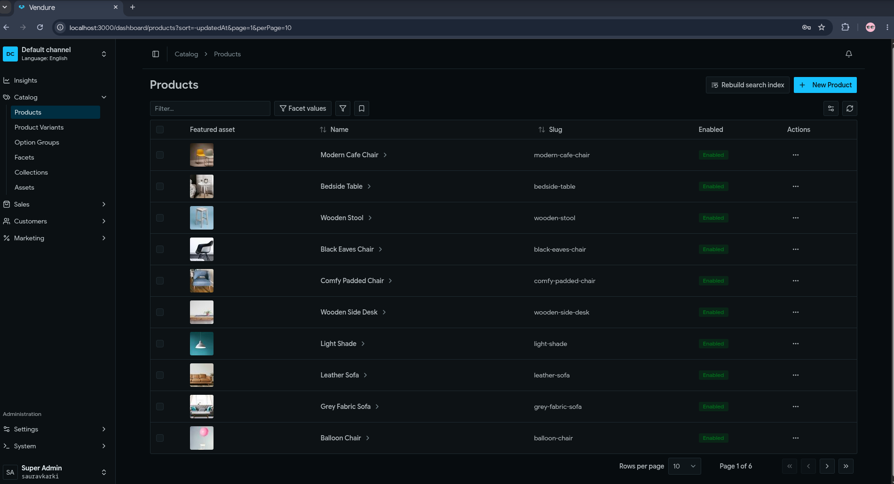
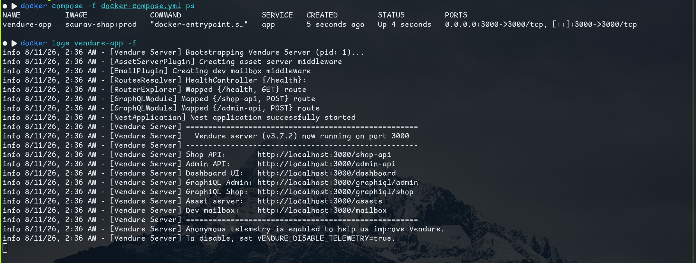
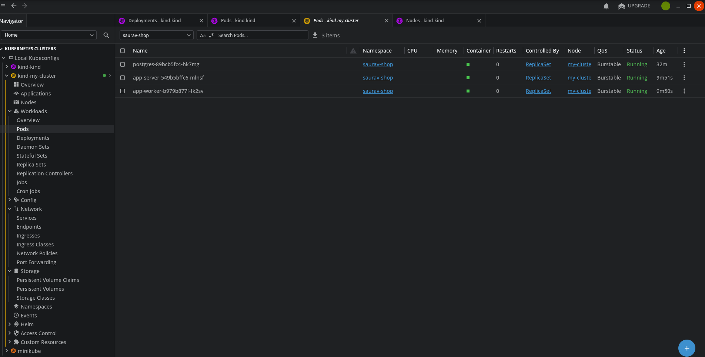

README.md

# Saurav Shop — Vendure Deployment Assignment

A Vendure e-commerce application, containerized and deployed to Kubernetes
via a Helm chart, with a CI/CD pipeline that builds, tags, and pushes images
to GitHub Container Registry on every change to `main`.

## Structure
- `saurav-shop/` — Vendure application (via @vendure/create)
- `db/` — local Postgres for development
- `docker/` — Dockerfiles + compose for dev/prod
- `k8s/` — raw Kubernetes manifests
- `helm/` — Helm chart packaging the k8s assets
- `.github/workflows/` — CI/CD pipeline

## Prerequisites
- Node.js (see .nvmrc)
- Docker
- kubectl / Helm (for deployment)


## Stack

- [Vendure](https://vendure.io) — application framework
- PostgreSQL 17 — database
- Docker — containerization (separate dev/prod images)
- Kubernetes (tested on `kind`) — orchestration
- Helm — packaging/deployment
- GitHub Actions — CI/CD, publishing to `ghcr.io`


## Quickstart — local development

1. Start Postgres:

```
       cd db/
       cp .env.example .env   # fill in real values
       docker compose -f postgres-docker-compose.yml up -d

```
2. Apply the initial database schema (one-time, only needed on a fresh
   database). Run this from the host, so DB_HOST must point at
   localhost:
```
       cd ../saurav-shop
       cp .env.example .env   # if not already done
       # In .env, set: DB_HOST=localhost
       npx vendure migrate
```
   Select "Run pending migrations".

3. Run the app in Docker. Since the app now runs inside the Docker
   network, DB_HOST must point at the Postgres container name instead:
```
       # In saurav-shop/.env, change DB_HOST back to: vendure-postgres
       cd ../docker
       docker compose up --build
```
App available at `http://localhost:3000/dashboard`.


## Documentation

Each piece has its own doc with the reasoning behind the decisions, not just
the commands:

- [`docs/docker.md`](docs/docker.md) — image structure, production image size
  investigation, Postgres version choice
- [`docs/kubernetes.md`](docs/kubernetes.md) — manifest layout, why server/worker
  are separate Deployments, config vs. secrets, health checks, migrations
- [`docs/helm.md`](docs/helm.md) — install/upgrade/uninstall, secret handling,
  first-deploy migration step
- [`docs/cicd.md`](docs/cicd.md) — pipeline design, tagging strategy, the
  values.yaml audit-trail pattern, what's deliberately out of scope and why

## Deploying

1. Build/push happens automatically via CI on every push to `main`
   (see `docs/ci-cd.md`).
2. Pull the latest `helm/saurav-shop/values.yaml` (CI keeps `image.tag` current).
3. Run the upgrade command in `docs/helm.md`, supplying secrets via
   `values-secret.yaml` (untracked, never committed).
4. On a first-ever install against a fresh database, follow the migration
   step in `docs/helm.md`.

## Design decisions worth knowing up front

- **SHA tags, not `latest`, for deploys** — `latest` is a convenience pointer
  only; every deploy is pinned to an immutable git SHA, both in the registry
  and in `values.yaml`, so the running state is always traceable and revertible.
- **Postgres runs in-cluster for this assignment**, but wouldn't in production
  — see `docs/kubernetes.md` for the managed-database reasoning.
- **No automated cluster deploy from CI** — the assignment's `kind` cluster
  isn't reachable from GitHub's hosted runners. CI stops at updating
  `values.yaml`; the actual `helm upgrade` is a manual step. See `docs/ci-cd.md`.

## Verified working

**Production Docker image, built and run:**



**Full stack running via docker-compose (app + Postgres):**



**Deployed and running on Kubernetes:**




## Tested with the latest updated tag by CI pipeline. 

```
  kubectl get pods -n saurav-shop
NAME                          READY   STATUS    RESTARTS      AGE
app-server-77fcf54989-644bs   1/1     Running   0             6m43s
app-worker-6845955b74-2s6m7   1/1     Running   0             6m35s
postgres-89bcb5fc4-tmkwt      1/1     Running   2 (30m ago)   24h

  kubectl get pods -n saurav-shop -o custom-columns='POD:.metadata.name,CONTAINER:.spec.containers[*].name,IMAGE:.spec.containers[*].image'
POD                           CONTAINER    IMAGE
app-server-77fcf54989-644bs   app-server   ghcr.io/iamsaurav-karki/vendure-deployment-assignment-devops:5cdc093
app-worker-6845955b74-2s6m7   app-worker   ghcr.io/iamsaurav-karki/vendure-deployment-assignment-devops:5cdc093
postgres-89bcb5fc4-tmkwt      postgres     postgres:17-alpine

  kubectl logs app-server-77fcf54989-644bs -n saurav-shop -f
info 8/12/26, 11:23 AM - [Vendure Server] Bootstrapping Vendure Server (pid: 1)...
info 8/12/26, 11:23 AM - [AssetServerPlugin] Creating asset server middleware
info 8/12/26, 11:23 AM - [EmailPlugin] Creating dev mailbox middleware
info 8/12/26, 11:23 AM - [RoutesResolver] HealthController {/health}:
info 8/12/26, 11:23 AM - [RouterExplorer] Mapped {/health, GET} route
info 8/12/26, 11:23 AM - [GraphQLModule] Mapped {/shop-api, POST} route
info 8/12/26, 11:23 AM - [GraphQLModule] Mapped {/admin-api, POST} route
info 8/12/26, 11:23 AM - [NestApplication] Nest application successfully started
info 8/12/26, 11:23 AM - [Vendure Server] ====================================================
info 8/12/26, 11:23 AM - [Vendure Server]   Vendure server (v3.7.2) now running on port 3000
info 8/12/26, 11:23 AM - [Vendure Server] ----------------------------------------------------
info 8/12/26, 11:23 AM - [Vendure Server] Shop API:       http://localhost:3000/shop-api
info 8/12/26, 11:23 AM - [Vendure Server] Admin API:      http://localhost:3000/admin-api
info 8/12/26, 11:23 AM - [Vendure Server] Dashboard UI:   http://localhost:3000/dashboard
info 8/12/26, 11:23 AM - [Vendure Server] GraphiQL Admin: http://localhost:3000/graphiql/admin
info 8/12/26, 11:23 AM - [Vendure Server] GraphiQL Shop:  http://localhost:3000/graphiql/shop
info 8/12/26, 11:23 AM - [Vendure Server] Asset server:   http://localhost:3000/assets
info 8/12/26, 11:23 AM - [Vendure Server] Dev mailbox:    http://localhost:3000/mailbox
info 8/12/26, 11:23 AM - [Vendure Server] ====================================================
info 8/12/26, 11:23 AM - [Vendure Server] Anonymous telemetry is enabled to help us improve Vendure.
info 8/12/26, 11:23 AM - [Vendure Server] To disable, set VENDURE_DISABLE_TELEMETRY=true.

```

